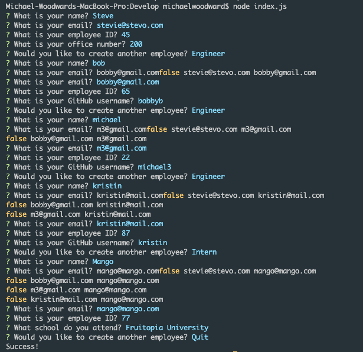
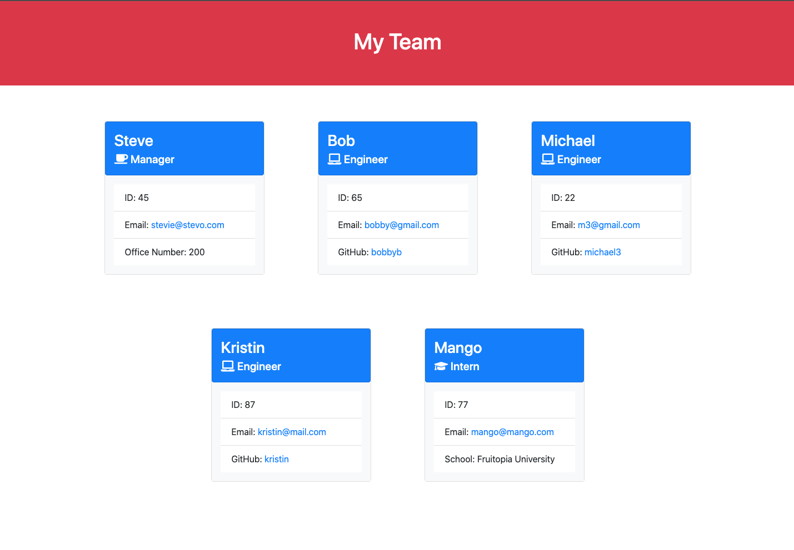
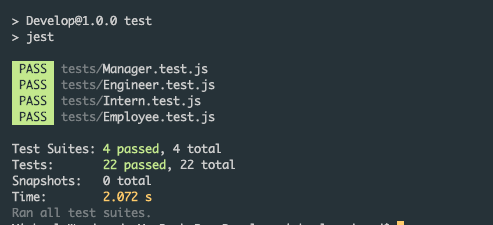

[](https://opensource.org/licenses/MIT)

# CLI Team Generator

## Table of Contents

* [Description](#Description)


* [Screenshots](#Screenshots)


* [Features](#Features)


* [Installation](#Installation)


* [Usage](#Usage)


* [License](#License)


* [Contribute](#Contribute)


* [Tests](#Tests)


* [Questions](#Questions)

## Description

A small CLI application that allows the user to dynamically generate a styled HTML document highlighting the details of a work team. This application is built using OOP predefining the structure of 3 employee sub classes and 1 super class to be used with data acquired from interacting with the CLI. The interactions are captured using the Inquirer library. Finally, the final generated html document is styled using the Bootstrap styling library.

## Screenshots





## Demo


<video width="320" height="240" controls>
  <source src="./screencast1.mov" type="video/mp4">
</video>

<video width="320" height="240" controls>
  <source src="./screencast2.mov" type="video/mp4">
</video>

## Features

- Es6 JavaScript

- Code refactored and reduced to be as DRY as possible

- Implementing switch case objects

```
  //switchCase function object to determine which type of class to construct the emmployee object with and then add to the employees array
  const setEmployee = {
    "Manager": (name, id, email, office) => employees.push(new Manager(name, id, email, office)),
    "Engineer": (name, id, email, github) => employees.push(new Engineer(name, id, email, github)),
    "Intern": (name, id, email, school) => employees.push(new Intern(name, id, email, school))
  };

  const { name, email, id, createNewEmployee, office, github, school } = response;

  setEmployee[type](name, id, email, office || github || school);

  ...

  //switchCase function object to dynamically set the List Item depending on the type of Employee
  const setListItem = ({ officeNumber, github, school, getRole }) => {
    return {
      "Manager": `Office Number: ${officeNumber}`,
      "Engineer": `GitHub: <a href="https://github.com/" target="blank">${github}</a>`,
      "Intern": `School: ${school}`
    }[getRole()];
  };
```

- Object Oriented Programming Class Implementation

```
class Employee {
  constructor(name, id, email) {
    this.name = name;
    this.id = id;
    this.email = email;
  }

  getName() { return this.name; }

  getId() { return this.id; }

  getEmail() { return this.email; }

  getRole() { return "Employee"; }
}

class Manager extends Employee {
  constructor(name, id, email, officeNumber) {
    
    super(name, id, email);
    
    this.officeNumber = officeNumber;
  }
  
  getRole() { return "Manager"; }
}

...

```

- Test Driven Development with Jest

```
const { Employee } = require("../lib/classes");

describe("Employee", () => {

  describe("Initialization", () => {
    it("should create an object with 'name', 'index', and 'email'", () => {
      const employee = new Employee("Tester", 1, "test@test.test");

      expect(employee).toEqual({name: "Tester", id: 1, email: "test@test.test"});
    });
  });

  describe("getName", () => {
    it("should return the value of the name property on the object", () => {
      const employee = new Employee("Tester", 1, "test@test.test");

      const name = employee.getName();

      expect(name).toEqual("Tester");
    });
  });

  ...

  });
```

- Input Validation using the Inquirer library and regex

```
const questions = (employees, type) => [
  {
    type: 'input',
    name: 'name',
    message: 'What is your name?',
    validate: value => value.match(/^[a-zA-Z]+$/) ? true : 'Please enter a valid name'
  },
  {
    type: 'input',
    name: 'email',
    message: "What is your email?",
    validate: value => 
      !value.match(/[^@ \t\r\n]+@[^@ \t\r\n]+\.[^@ \t\r\n]+/) ? 'Please enter a valid email' :
      
  },
  {
    type: 'number',
    name: 'id',
    message: 'What is your employee ID?',
    validate: value => value.toString().match(/\b([0-9]|[1-9][0-9])\b/) ? true : 'Please enter a valid number between 0 - 99'
  },
  relativeQuestion(employees, type),
  {
    type: 'rawlist',
    name: 'createNewEmployee',
    message: 'Would you like to create another employee?',
    choices: ["Engineer", "Intern", "Quit"],
    default: 0
  }
];

module.exports = questions;
```

## Installation

1. `git clone https://github.com/loveliiivelaugh/cli-team-generator.git`

2. `npm install`

## Usage

1. `node index.js`

2. Use the terminal to answer the questions and navigate the menu.

3. The generated html file will be located at `./dist/index.html`

## License

Copyright 2021
Permission is hereby granted, free of charge, to any person obtaining a copy of this software and associated documentation files (the "Software"), to deal in the Software without restriction, including without limitation the rights to use, copy, modify, merge, publish, distribute, sublicense, and/or sell copies of the Software, and to permit persons to whom the Software is furnished to do so, subject to the following conditions:
The above copyright notice and this permission notice shall be included in all copies or substantial portions of the Software.
THE SOFTWARE IS PROVIDED "AS IS", WITHOUT WARRANTY OF ANY KIND, EXPRESS OR IMPLIED, INCLUDING BUT NOT LIMITED TO THE WARRANTIES OF MERCHANTABILITY, FITNESS FOR A PARTICULAR PURPOSE AND NONINFRINGEMENT. IN NO EVENT SHALL THE AUTHORS OR COPYRIGHT HOLDERS BE LIABLE FOR ANY CLAIM, DAMAGES OR OTHER LIABILITY, WHETHER IN AN ACTION OF CONTRACT, TORT OR OTHERWISE, ARISING FROM, OUT OF OR IN CONNECTION WITH THE SOFTWARE OR THE USE OR OTHER DEALINGS IN THE SOFTWARE.
        

[MIT License](https://www.mit.edu/~amini/LICENSE.md)

## How to Contribute

Open to contributions.

## Tests

Tests are located in the `./tests/` directory. There is one file containing all of the tests for each of the 4 classes.

1. To run the tests --> `npm run test`



## Questions

Follow me at my [GitHub](https://github.com/loveliiivelaugh) to discover more of my projects.

Feel free to reach out at my email [woodward.michael.a@gmail.com](woodward.michael.a@gmail.com) if you have any odditional questions or just want to chat!


#### This README was generated with the [CLI README Generator](https://github.com/loveliiivelaugh/nu-hw9-cli-readme-generator) app.
